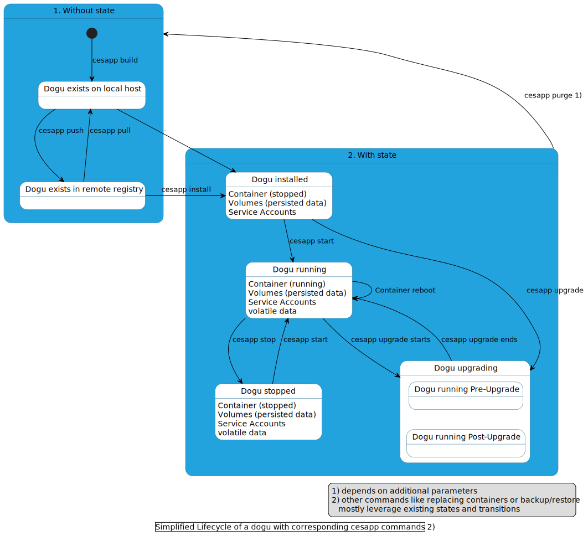
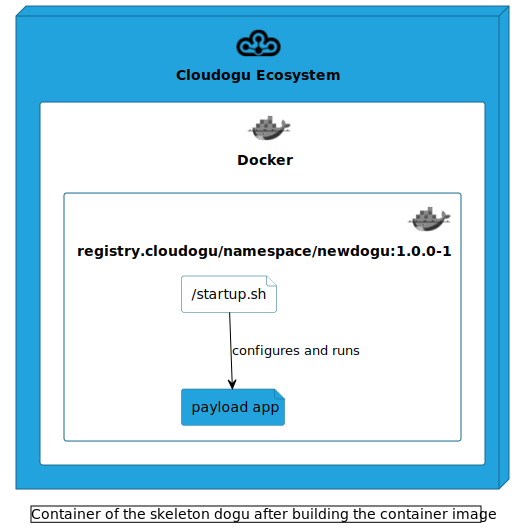

# Einleitung & Basics

Ein Dogu (aus dem Japanischen abgeleitet für „Werkzeug“) stellt eine containerisierte Anwendung im Cloudogu EcoSystem (CES) zur Verfügung.
Dogus können unterschiedliche Nutzungsaspekte befriedigen, wie z.B. eine Projektverwaltung (gegenüber Benutzenden) oder ein Datenbankmanagementsystem (gegenüber anderen Dogus).
Daraus schließt sich, dass Dogus mehr können müssen als mit reinen Docker-Direktiven möglich wäre. Denkt man an die obigen Dogus, ist es unter anderem sinnvoll einen ServiceAccount-Mechanismus für die Kommunikation von 
der Projektverwaltungssoftware zu dem Datenbankmanagementsystem zu verwenden. Diese und weitere Möglichkeiten bietet das Dogu als Erweiterung zu einem reinen Containerimage.

Dieses Dokument beschreibt, wie so ein Dogu entwickelt werden kann.
Es wird zunächst gezeigt welche Zustände ein Dogu selbst annehmen kann.
Anschließend wird mit dem Quick-Start-Guide
die Erstellung eines minimalen Dogus beschrieben.

## Voraussetzungen

Für die Dogu-Entwicklung sollten gewisse Vorkenntnisse vorhanden sein. 
Dies umfasst einen vertrauten Umgang mit der Container-Virtualisierungssoftware Docker, Bash und einem Verständnis der, für die Dogu Erstellung ausgewählten, Zielsoftware.

Benötigte Entwicklungssoftware:
- [git](https://git-scm.com)
- [virtualbox](https://www.virtualbox.org)
- [vagrant](https://vagrantup.com)

## Dogu-Lifecycle

Dieser Abschnitt stellt unterschiedliche Phasen vor, die ein Dogu im Laufe der Entwicklung, Releases und des Betriebs durchlaufen kann.
Hierfür ist die Dogu-Orcherstrierungsanwendung `cesapp` zuständig.
Genauere Hilfen sind in der [cesapp-Dokumentation](https://docs.cloudogu.com/de/docs/system-components/cesapp/operations/detail/) oder in der Kommandobeschreibung auf der Konsole mittels `cesapp --help` zu finden.



## Dogu-Quick-Start

Dieser Abschnitt beschreibt ein Minimalskelett eines Dogus, das eine Webseite produziert.
Hier werden nahezu alle Querschnitts-Aspekte ignoriert, die im Zusammenspiel im CES stattfinden können, d. h. ohne:
- Single Sign-on/Single Log-out
- Dogu-Abhängigkeiten
- Backup/Restore
- Dogu-Release
- Dogu-Konfiguration über die Registry
- etc.

Solch ein Minimal-Dogu beantwortet lediglich Request, die über den zentralen Reverse-Proxy (das nginx-Dogu) eingehen.
Dazu werden die folgenden Bestandteile benötigt:

1. Ein laufendes, fertig aufgesetztes CES.
2. Ein neues Verzeichnis, das die Dogu-Bestandteile bündelt, z. B. `newdogu`.
3. Dockerfile: `newdogu/Dockerfile`
   - Erstellung des Docker-Images für das neue Dogu.
4. Dogu-Descriptor: `newdogu/dogu.json`
   - Enthält Informationen, die bei Installation und auch bei jedem Start des Dogus von Bedeutung sind.
5. Eine Webanwendung
     - Die Fachanwendung, entweder als Quellcode oder in einer ausführbaren Form.
   
### 1) CES aufsetzen

- `git clone https://github.com/cloudogu/ecosystem`
- `cd ecosystem`
- `vagrant up`

Anschließend muss das Setup des CES auf `http://192.168.56.2:8080` durchgeführt werden. Dabei muss sich ein kostenloser Account
bei der Platform `mycloudogu` erstellt werden und das Dogu `nginx` im Dogu-Schritt ausgewählt werden.
Eine detailliertere Beschreibung wie man das Setup durchführt ist im [Quick-Start-Guide des CES](https://docs.cloudogu.com/de/quickstart/) zu finden.

### 2) Verzeichnis anlegen

Ein Verzeichnis muss angelegt werden, das die Dogu-Dateien aufbewahren soll.

Beispiel: `mkdir containers/newdogu`.

Innerhalb der eben gestarteten VM von `vagrant` ist das Verzeichnis unter `/vargrant/containers/newdogu` zu finden.

### 3) Dockerfile

Wie bereits erwähnt, stellt ein Dogu eine containerisierte Anwendung dar.
Daher muss ein Container-Image erzeugt werden, das dann zu einem Container instanziiert wird.

- Allgemeine Richtlinien zum Schreiben von Dockerfiles finden sich im Bereich [Docker Builder](https://docs.docker.com/engine/reference/builder/) und im Bereich [Best Practices](https://docs.docker.com/develop/develop-images/dockerfile_best-practices/) von Docker.
- Dogu-Base-Images:
  - Für Java-basierte Anwendungen kann das Cloudogu [Java](https://github.com/cloudogu/java)-Base-Image verwendet werden.
  - Für andere Anwendungen wird das Cloudogu [base](https://github.com/cloudogu/base)-Image verwendet.
  - Dogu-Base-Images enthalten auch immer die Anwendung `doguctl`, mit der sich viele übliche Aufgaben noch leichter durchführen lassen:
    - Zugriff auf Konfigurationswerte
    - Verschlüsselung eigener Konfigurationswerte
    - Go-Templating
    - Health-Checks
- Wenn das Dogu eine Web-Anwendung ist, ist die Zeile `ENV SERVICE_TAGS webapp` notwendig.
  Dies führt dazu, dass das neue Dogu im Warp-Menü angezeigt wird.
- Kopieren Sie Ihre Ressourcen in das dogu, falls erforderlich.
- Das Label `MAINTAINER` dient zur schnelleren Kommunikation bei Supportfällen.

Beispiel:

`containers/newdogu/Dockerfile`

```dockerfile
FROM registry.cloudogu.com/official/base:3.17.1-1

LABEL NAME="official/newdogu" \
   VERSION="1.0.0-1" \
   MAINTAINER="your.maintainer.or.catchall@company.com"

ENV SERVICE_TAGS=webapp \
    SERVICE_REWRITE='{"pattern": "newdogu", "rewrite": ""}'
    
RUN set -x \
 && addgroup -S "newdogu" -g 1000 \
 && adduser -S -h "/home/newdogu" -G "newdogu" -u 1000 -s /bin/bash "newdogu" \
 # install runtime packages
 && apk --no-cache add python3

COPY startup.sh /

USER newdogu:newdogu

WORKDIR /home/newdogu

HEALTHCHECK CMD doguctl healthy newdogu || exit 1

EXPOSE 8080

CMD ["/startup.sh"]
```

### 4) Dogu.json

Die Dogu.json definiert grundlegende Informationen des Dogus und bietet die Möglichkeit komplexere Eigenschaften,
wie z.B. Service-Accounts oder Volumes mit speziellen Rechten zu definieren.
Zusammen mit dem Docker-Image bilden die beiden Artefakte später das Release. 

Beispiel:

`containers/newdogu/dogu.json`

```json
{
  "Name": "official/newdogu",
  "Version": "1.0.0-1",
  "DisplayName": "My new Dogu",
  "Description": "Newdogu is a test application",
  "Category": "Development Apps",
  "Tags": ["warp"],
  "Url": "https://www.company.com/newdogu",
  "Image": "registry.cloudogu.com/namespace/newdogu",
  "Dependencies": [
    {
      "type":"dogu",
      "name":"nginx"
    }
  ],
  "Volumes": [],
  "ExposedCommands": [],
  "ServiceAccounts": [],
  "Configuration": [],
  "HealthChecks": [
    {
      "Type": "tcp",
      "Port": 8080
    }
  ]
}
```

### 5) Erstellung einer exemplarischen Anwendung

Die eigentliche Anwendung wird üblicherweise im Dockerfile heruntergeladen.
In einem Skript lässt sich diese konfigurieren und am Schluss starten.
In unserem Fall ist es ein einfaches Bash-Skript, welches die globale Konfiguration ausliest und einen Http-Server startet.

Beispiel:

`containers/newdogu/startup.sh`

```bash
#!/bin/bash
set -o errexit
set -o nounset
set -o pipefail

FQDN=$(doguctl config --global fqdn)
echo "Your fqdn is: ${FQDN}"

python3 -m http.server 8080
```
### Das Dogu erstellen

- `vagrant up` - Falls die Maschine nicht gestartet ist.
- `vagrant ssh`
- `cd /vagrant/containers/newdogu`
- `sudo cesapp build .`
- `sudo cesapp start newdogu`



### Das Dogu testen
- Ausgaben im Log prüfen, ob Dogu korrekt gestartet wurde:
  - `cat /var/log/docker/newdogu.log`
- `https://192.168.56.2/newdogu` aufrufen.