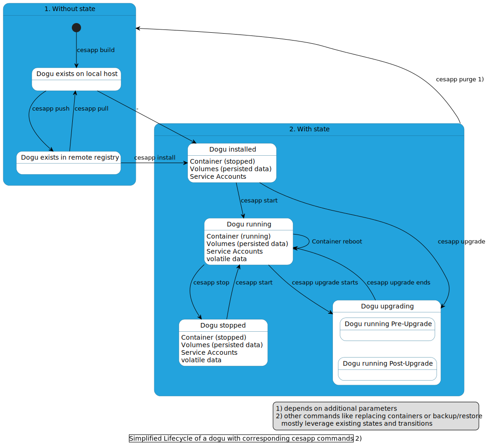

# Introduction & Basics

A dogu (derived from Japanese for "tool") provides a containerized application in the Cloudogu EcoSystem (CES).
Dogus can satisfy different usage aspects, such as a project management (towards users) or a database management system (towards other dogus).
It follows that dogus must be able to do more than would be possible with pure Docker directives. Thinking of the above dogus, it makes sense, among other things, to have a ServiceAccount mechanism for communication from
the project management software to the database management system. The Dogu offers these and other possibilities as an extension to a pure container image.

This document describes how such a Dogu can be developed.
It is first shown which states a Dogu itself can assume.
Afterwards the Quick-Start-Guide describes the creation of a minimal dogu.

## Prerequisites

Certain prior knowledge should be present for Dogu development.
This includes a familiarity with Docker container virtualization software, Bash, and an understanding of the target software selected for Dogu creation.

Required development software:
- [git](https://git-scm.com)
- [virtualbox](https://www.virtualbox.org)
- [vagrant](https://vagrantup.com)

## Dogu Lifecycle

This section presents different phases that a Dogu can go through during development, releases and operation.
The Dogu orchestration application `cesapp` is responsible for this.
More detailed help can be found in the [cesapp documentation](https://docs.cloudogu.com/de/docs/system-components/cesapp/operations/detail/) or in the command description on the console using `cesapp --help`.



## Dogu Quick Start

This section describes a minimal skeleton of a Dogu that produces a web page.
Here we ignore almost all cross-sectional aspects that can take place in the interaction in the CES, which are:
- Single sign-on/single log-out
- Dogu dependencies
- Backup/restore
- Dogu release
- Dogu configuration via registry
- etc.

Such a minimal dogu only answers requests coming in through the central reverse proxy (the nginx Dogu).
For this the following components are needed:

1. A running CES.
2. A new directory that bundles the Dogu components, e.g. `newdogu`.
3. Dockerfile: `newdogu/Dockerfile`
    - Creation of the Docker image for the new Dogu.
4. Dogu descriptor: `newdogu/dogu.json`
    - Contains information that is important at installation and also at each start of the Dogu.
5. A web application
    - The specialized application, either as source code or in an executable form.

### 1) Setup CES

- `git clone https://github.com/cloudogu/ecosystem`
- `cd ecosystem`
- `vagrant up`

Afterwards, the setup of the CES must be performed at `http://192.168.56.2:8080`.
In the process you have to create a free account at the platform `myCloudogu` and select the Dogu `nginx` in the Dogu step.
A more detailed description of how to perform the setup can be found in the [Quick-Start-Guide of the CES](https://docs.cloudogu.com/de/quickstart/).

### 2) Create directory

A directory must be created to keep the Dogu files.

Example: `mkdir containers/newdogu`.

Inside the just started VM of `vagrant` the directory can be found at `/vargrant/containers/newdogu`.

### 3) Dockerfile

As mentioned earlier, a Dogu represents a containerized application.
Therefore, a container image must be created, which is then instantiated into a container.

- General guidelines for writing Dockerfiles can be found in the [Docker Builder](https://docs.docker.com/engine/reference/builder/) section and the [Best Practices](https://docs.docker.com/develop/develop-images/dockerfile_best-practices/) section of Docker.
- Dogu base images:
   - For Java-based applications, the Cloudogu [Java](https://github.com/cloudogu/java) base image can be used.
   - For other applications, the Cloudogu [base](https://github.com/cloudogu/base) image can be used.
   - Dogu base images also always include the `doguctl` application, which makes many common tasks even easier to perform:
      - Access to configuration values
      - Encryption of own configuration values
      - Go-templating
      - Health checks
- If the Dogu is a web application, the line `ENV SERVICE_TAGS=webapp` is necessary.
  This will cause the new dogu to appear in the warp menu.
- Copy your resources into the Dogu if necessary.
- The label `MAINTAINER` is used for faster communication in support cases.

Example:

`containers/newdogu/Dockerfile`

```dockerfile
FROM registry.cloudogu.com/official/base:3.17.1-1

LABEL NAME="official/newdogu" \
   VERSION="1.0.0-1" \
   MAINTAINER="your.maintainer.or.catchall@company.com"

ENV SERVICE_TAGS=webapp \
    # This is a special environment variable to tell the nginx to rewrite the regular path for the dev python server.
    # It is necessary because all Dogus are available a https://<fqdn>/<dogu_name>.
    SERVICE_REWRITE='{"pattern": "newdogu", "rewrite": ""}'
    
RUN set -x \
 && addgroup -S "newdogu" -g 1000 \
 && adduser -S -h "/home/newdogu" -G "newdogu" -u 1000 -s /bin/bash "newdogu" \
 # install runtime packages
 && apk --no-cache add python3

COPY startup.sh /

USER newdogu:newdogu

WORKDIR /home/newdogu

HEALTHCHECK CMD doguctl healthy newdogu || exit 1

EXPOSE 8080

CMD ["/startup.sh"]
```

### 4) Dogu.json

The Dogu.json defines basic information of the Dogu and offers the possibility to define more complex properties,
such as service accounts or volumes with special rights.
Together with the Docker image, the two artifacts later form the release.

Example:

`containers/newdogu/dogu.json`

```json
{
  "Name": "official/newdogu",
  "Version": "1.0.0-1",
  "DisplayName": "My new Dogu",
  "Description": "Newdogu is a test application",
  "Category": "Development Apps",
  "Tags": ["warp"],
  "Url": "https://www.company.com/newdogu",
  "Image": "registry.cloudogu.com/namespace/newdogu",
  "Dependencies": [
    {
      "type":"dogu",
      "name":"nginx"
    }
  ],
  "Volumes": [],
  "ExposedCommands": [],
  "ServiceAccounts": [],
  "Configuration": [],
  "HealthChecks": [
    {
      "Type": "tcp",
      "Port": 8080
    }
  ]
}
```

### 5) Creating an exemplary application

The actual application is usually downloaded in the Dockerfile.
It can be configured in a script and started at the end.
In our case, it is a simple bash script that reads the global configuration and starts a http server.

Example:

`containers/newdogu/startup.sh`

```bash
#!/bin/bash
set -o errexit
set -o nounset
set -o pipefail

FQDN=$(doguctl config --global fqdn)
echo "Your fqdn is: ${FQDN}"

python3 -m http.server 8080
```

### Create the dogu

- `vagrant up` - If the machine is not started.
- `vagrant ssh`
- `cd /vagrant/containers/newdogu`
- `sudo cesapp build .`
- `sudo cesapp start newdogu`


### Test the Dogu

- Check output in log if Dogu was started correctly:
    - `cat /var/log/docker/newdogu.log`.
- Visit: `https://192.168.56.2/newdogu`.