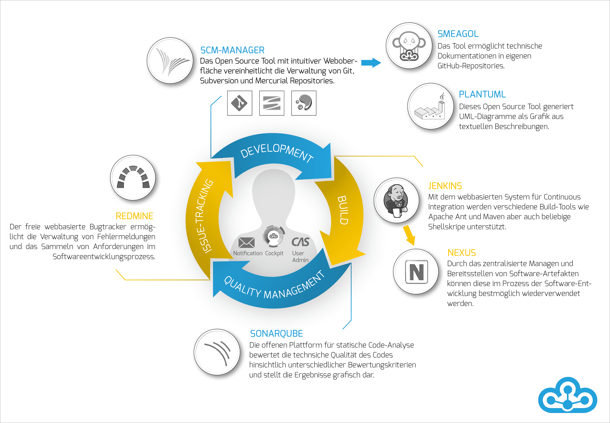
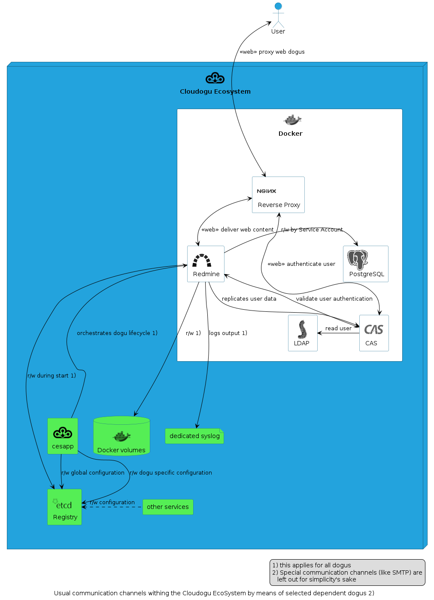

# CES-Kontext

gewollte Inhalte:
* Reverse-Proxy Nginx
* R/W mit etcd
* zentrales Logging

Dieser Abschnitt beschreibt weitere Informationen, die Dogu-Entwickelnden helfen, sich im Gesamtsystem zurechtzufinden. 
In diesem Abschnitt können Dogu-Entwickler weitergehende Informationen finden, um z. B. Kopplung mit Fremdsystemen oder 
anderen CES-Komponenten anzubinden.
https://docs.cloudogu.com/de/docs/introduction/

# Einleitung

[//]: #  (TODO: Kommentar Boris: Dieser Teil könnte mit dem darauf folgenden Teil zusammengefasst werden. Kontext ist gut, aber in dieser Doku geht es um Dogu-Entwicklung im Speziellen.)
[//]: #  (TODO: ist das nicht viel zu Basic für Kapitel 4?)

## Was ist das Cloudogu EcoSystem?
Das Cloudogu EcoSystem ist eine Plattform, die Entwicklungsteams die Freiheit gibt, selbst zu entscheiden, wann und wo 
sie Software entwickeln. Dazu werden jeder Service und jedes Tool als ein sogenanntes Dogu bereitgestellt und 
automatisch aufeinander abgestimmt und konfiguriert. Dadurch hält das Cloudogu EcoSystem eine Reihe von Vorzügen für 
Softwareentwicklerinnen und Softwareentwickler bereit:

* einen zentralen Authentifizierungsservice
* eine dynamische Navigation zwischen den Dogus
* Dogu übergreifende automatisierte Prozesse, von den Commit-Nachrichten bis zum Build des Projekts
  * ein Push von Änderungen führt automatisch zum Build des Projekts
  * durch die Verwendung von Schlüsselwörtern in Commit-Nachrichten kann sowohl der Status von Tickets in Redmine geändert, als auch Kommentare hinzugefügt werden.

## Single Sign-on

[//]: #  (TODO: mehr Vertriebs-Featureübersicht als Doku bisher)

Arbeitsabläufe im Cloudogu EcoSystem gestalten sich durch das integrierte Single Sign-on (SSO) besonders flüssig. 
So kann beliebig zwischen den Dogus gewechselt werden, ohne dass eine erneute Anmeldung nötig wird. Für das 
Single Sign-on können eigene Verzeichnisdienste verwendet oder es kann ein lokaler Verzeichnisdienst mit 
installiert werden. Dieser integrierte Verzeichnisdienst kann über ein eigenes Dogu verwaltet werden.

Funktionsübersicht:
* vollständig integriertes SSO über alle verfügbaren Dogus
* zusätzlich zum SSO über den Browser kann der Authentisierungsmechanismus auch über Tools, z.B. für eine nahtlose IDE-Anbindung, verwendet werden
* zentrales Benutzerinnen- und Benutzermanagement (siehe User Management) und durchgängige Verwendung von Gruppen

## Sicherheit

Das Cloudogu EcoSystem wurde mit stetigem Blick auf aktuelle Sicherheitsstandards entwickelt. Die strikte Verwendung 
von SSL zur Verschlüsselung von Verbindungen und die Kapselung jedes Dogus in Container sowie die Verschlüsselung von 
sicherheitsrelevanten Konfigurationen sind nur ein Auszug aus den, in den Entwurf eingeflossenen, Maßnahmen.

Auszug aus den Sicherheitsmaßnahmen:
* ausschließlich SSL-verschlüsselte Verbindungen möglich
* selbst signierte Zertifikate für interne Verwendung, Integration eigener Zertifikate für produktiven Einsatz über Setup möglich
* isolierte Umgebung für jedes installierte Dogu (ein Container pro Dogu)
* verschlüsselte Ablage sensibler Informationen innerhalb der Dogus (ein Schlüsselpaar pro Dogu)
* dedizierte systemische Zugriffsberechtigungen für den Zugriff auf Tools bzw. für die Tool-Kommunikation

## Technologisches Umfeld

Das Cloudogu EcoSystem basiert auf einem Linux-Image, welches für verschiedene Virtualisierungsumgebungen 
bereitgestellt wird. Die Installation kann sowohl manuell über einen Browser als auch automatisch über 
eine Parameterdatei erfolgen, die die Installation der als Docker-Container realisierten Dogus vornimmt. 
Die einzelnen Container werden über eine eigens dafür programmierte Middleware zentral konfiguriert. 
Die Abbilder bzw. Versionen der Dogus können sowohl online als auch "on Premise" als Mirror bereitgestellt werden, 
sodass keine Internetverbindung benötigt wird.

* Linux-basiertes Image – Erstellung mit Packer für Zielumgebungen (VMware, VirtualBox, QEMU)
* manuelle Konfiguration oder über automatische Parametrisierung per JSON-Datei für Cloud-Umgebungen
* Realisierung der Dogus mit Docker
* zentrales Konfigurationsmanagement über Etcd
* Verfügbarkeit der Dogus über online-Repository (Cloudogu) oder Mirror (offline/online)

# Architektursicht

Ein Cloudogu EcoSystem (CES) stellt eine skalierbare Plattform dar, um Softwareentwicklungsteams schnell 
einen Werkzeugkasten für Continuous Integration, -Deployment oder DevOps zur Verfügung zu stellen.
Dabei stellt Docker als Containervirtualisierung und die CES-Registry (eine Key-Value-Datenbank auf Basis von etcd) 
besondere Angelpunkte in der Gesamtarchitektur dar.

[//]: #  (TODO: nachfolgende Referenzen prüfen)

Die folgenden Abschnitte gehen näher auf diese (und natürlich noch andere interessante) Teile ein.

Die Basis des CES stellt ein Ubuntu-System dar, welches vorkonfiguriert als VM ausgebracht wird.

Erst mit der Durchführung des Setup wird das CES voll funktionstüchtig, denn unterschiedliche Teams 
haben unterschiedliche Ansprüche an die Werkzeuge, die sie benötigen.

[//]: #  (TODO: nachfolgende Referenzen prüfen)

Mehr hierzu beschreibt der Abschnitt „CES-Setup“ in diesem Kapitel. Die folgende Abbildung stellt exemplarisch dar, 
wie Dogus und Systemteile zusammenspielen.

Auf die gezeigten Abhängigkeiten und Kommunikationswege wird ebenfalls später eingegangen.

## Docker

Dogus sind grundsätzlich Docker-Container, die bestimmten Anforderungen genügen müssen, 
um im CES als solche erkannt zu werden.
Docker-Container ermöglichen ein schnelles Austauschen der containerisierten Anwendung 
und befähigen Entwickelnde in produktionsähnlichen Umgebungen Fehler zu suchen.
Das Kapitel 2 gibt weitere Hinweise, wie sich Container optimal bauen lassen.

[//]: #  (TODO: vorherige Referenz prüfen)

## CES-Registry

Die CES-Registry ist eine Key-Value-Datenbank auf Basis von [etcd](https://etcd.io/).
Darin werden unterschiedlichste Werte abgelegt.
Dieser Abschnitt konzentriert sich auf relevante Bereiche für die Dogu-Entwicklung.
Damit ein Dogu Werte abrufen kann, muss es wissen, unter welcher Adresse die Registry verfügbar ist.
Die Datei node_master enthält eine IP-Adresse.
Sowohl im Hostsystem als auch im Dogu-Container wird diese Datei im Pfad `/etc/ces/node_master` bereitgestellt bzw. gemountet.
Mit geeigneten Mitteln (wie z. B. doguctl) ist es nun möglich, Abfragen gegen die Registry abzusetzen.

## SSL-Zertifikat

Daten werden nur über HTTPS (verschlüsselt mit einem SSL-Zertifikat) ausgetauscht.
Das CES kann mit extern ausgestellten Zertifikaten arbeiten oder selbst-signierte Zertifikate anlegen.

## Systemdienste

Da Container nicht in das Hostsystem eingreifen sollten, existieren im CES unterschiedliche Systemdienste, 
die bestimmte Aufgaben auf dem Host ausführen, unter anderem ces-setup.

### CES-Setup

[//]: #  (TODO: Kommentar Boris: Setup ist für die Dogu-Entwicklung eher irrelevant. Dies kann sicherlich auf 1-2 Sätze zusammengestaucht werden.)

Organisationen haben unterschiedliche Vorstellungen, in welcher Umgebung ein CES ausgeführt werden soll.
Genauso haben Teams unterschiedliche Wünsche, welche Dogus sie nutzen möchten.
Damit möglichst vielen dieser Wünsche entsprochen werden kann, besteht mit dem CES-Setup eine flexible Möglichkeit, 
eine CES-Instanz beim erstmaligen Aufsetzen seinen eigenen Bedürfnissen anzupassen.
Dieser Vorgang lässt sich sowohl manuell per Webbrowser als auch head-less mittels der `setup.json`-Datei bedienen.
Die Beschreibung der `setup.json` liegt außerhalb des Umfanges dieser Dokumentation und wird an anderer Stelle beschrieben.
Nach der Instanz-Registrierung ist es hiermit möglich, auf Netzwerk-Spezifika einzugehen oder eventuell einen eigenen 
(externen) LDAP-Server zu konfigurieren. Abschließend lassen sich dann die zur Verfügung stehenden Dogus installieren.
Es ist kein Problem, wenn versehentlich ein Dogu zu viel installiert oder eines zu installieren vergessen wurde. 
Es lassen sich nach der Setup-Durchführung mit der cesapp ganz leicht diese (und noch weitere) Aufgaben nachholen.

[//]: #  (TODO: Link zu setup.json Doku hinzufügen)

## Logging per Syslog

Da viele Dogus in einem CES laufen, ist es sinnvoll nicht alle Container-Logausgaben in einer großen Datei zu sammeln.
Daher sorgt die mitgelieferte Syslog-Konfiguration dafür, dass jedes Dogu ein einzelnes Logfile unter dem Pfad 
`/var/log/docker/` schreibt, um bspw. Log-Forwarding oder Analysen zu ermöglichen.

### Externe Dienste

Einzelne Dogus bedürfen einer Kommunikation zu Stellen, die außerhalb des CES liegen.
Dieser Abschnitt erläutert Besonderheiten.

#### Externer LDAP-Dienst

Anstelle des OpenLDAP-Dogus kann auch ein eigener, externer LDAP-Dienst angebunden werden.
Die Kommunikation zwischen beteiligten Dogus und dem LDAP-Dienst findet über übliche Netzwerkprotokolle statt.

[//]: #  (TODO: Kommentar Boris: hier sollte auch das LDAP-Mapper-Dogu erwähnt werden, und wie man diesen verwendet)

#### SMTP (Postfix)

Viele Dogus können Mails versenden, um Benutzer über Ereignisse zu informieren.
Das Postfix-Dogu dient hierbei als Zwischenstation, das allerdings eine externe Gegenstelle (ein Relay-Host) benötigt.
Das verwendete Protokoll ist geschütztes oder ungeschütztes SMTP.
