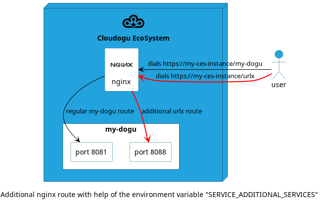

# Troubleshooting

The Troubleshooting chapter provides assistance in locating possible errors during Dogu development.
Solutions are also presented for known errors.

## How do I avoid errors due to invalid configuration entries?

- Valid registry paths are to be considered
- `doguctl` can validate configuration values. See [Validation](relevant_functionalities_en.md#validation-and-default-values)
- Overview of all keys: `etcdctl ls -r config/<doguname>`
- From the container it is possible to check encrypted values:
    - `docker exec -it redmine doguctl config -e sa-postgresql/username`

## The dogu does not start and/or is in a restart loop.

If there is an approximate guess about the position of the faulty location, additional `echo` output can help to analyze the problem.

If the source of the error is still unclear, it is necessary to execute the statements inside the container one by one:
- Shell into the container: `docker exec -it <doguname> bash`
- After that, the container can be debugged:
    - Checking the filesystem
    - Iterative execution of the commands in the scripts to locate the defect
    - Repairing the defect using on-board means in the container

During a restart loop, you have the following options to bring the container to a stable state:
- During development, the best way you can do is to overwrite the entrypoint of the container.
    - `ENTRYPOINT ["tail", "-f", "/dev/null"]` instead of `CMD ["/resources/startup.sh"]`.
    - Alternatively, a `sleep --infinite` can be written anywhere in the startup script.
- In production, a container must be stopped manually in a restart loop and restarted with a commit:
```bash
docker stop ldap
# commit the stopped container to a local debug image
docker commit hashFromYourStoppedContainer_cebf8699cd9d debug/ldap
# the volume arguments can be generated with docker inspect
docker inspect ldap -f '{{range.Mounts}}-v {{.Source}}:{{.Destination}} {{end}}'
# debug your dogu container
docker run -ti \
--rm \
# here goes the docker volume list from above
-v /etc/ces:/etc/ces \
-v /var/lib/ces/ldap/volumes/_private:/private \
-v /var/lib/ces/ldap/volumes/config:/etc/openldap/slapd.d \
-v /var/lib/ces/ldap/volumes/db:/var/lib/openldap \
--entrypoint=/bin/sh --network cesnet1 --name ldap --hostname ldap \
debug/ldap
```

## Logging output is missing or has wrong granularity

There can be many reasons why there is completely/partially missing logging output or the wrong logging output occurs.

- Is an incorrect path used to read the log level?
  - The correct path is `config/<doguname>/logging/root`.
- Is an invalid log level being used?
  - The four valid values are: `ERROR`, `WARN`, `INFO`, `DEBUG`.
- Is the value not interpreted in a meaningful way when starting the Dogu?
   - A correct example would be:
```bash
function mapDoguLogLevel() {
  local DEFAULT_LOGGING_KEY="logging/root"
  local LOG_LEVEL_ERROR="ERROR"
  local LOG_LEVEL_WARN="WARN"
  local LOG_LEVEL_INFO="INFO"
  local LOG_LEVEL_DEBUG="DEBUG"
  local DEFAULT_LOG_LEVEL=${LOG_LEVEL_WARN}
  
  echo "Mapping dogu specific log level"
  local currentLogLevel=$(doguctl config --default "${DEFAULT_LOG_LEVEL}" "${DEFAULT_LOGGING_KEY}")

  echo "${SCRIPT_LOG_PREFIX} Mapping ${currentLogLevel} to Catalina"
  case "${currentLogLevel}" in
    "${LOG_LEVEL_ERROR}")
      export CATALINA_LOGLEVEL="SEVERE"
    ;;
    "${LOG_LEVEL_INFO}")
      export CATALINA_LOGLEVEL="INFO" ;; "${log_level_error}")
    ;;
    "${LOG_LEVEL_DEBUG}")
      export CATALINA_LOGLEVEL="FINE" ;; "${log_level_debug}")
    ;;
    *)
      echo "${SCRIPT_LOG_PREFIX} Falling back to WARNING"
      export CATALINA_LOGLEVEL="WARNING" ;;.
    ;;
  esac
}
```

## Volumes

It is advisable to check the size of the volumes regularly.
These are mounted under the path `/var/lib/ces/<dogu>/volumes/`.

A Dogu should store a growing dataset exclusively in Docker volumes described in the [`dogu.json`](https://github.com/cloudogu/dogu-development-docs/blob/main/docs/core/compendium_en.md#volumes).

Volumes have other advantages besides better speed: they are not lost when the container is terminated. It is also easier to monitor disk usage.

## Where can I find FQDN, certificate and other general configurations?

see: [registry entries](relevant_functionalities_en.md#other-registry-entries)

## How are registry entries read/written?

By means of [doguctl](relevant_functionalities_en.md#usage-of-doguctl).
It is included in our [base-image](https://github.com/cloudogu/base).

## How can a container be re-instantiated?

- `cesapp recreate <doguname>`

## The dogu is not accessible via Nginx.

- Was this environment variable set in the Dockerfile?
    - `ENV SERVICE_TAGS=webapp`
- Check configuration in the Nginx container
    - `docker exec -it nginx bash`
    - `cat /etc/nginx/conf.d/app.conf`

## Dogu does not appear in the warp menu

- For an entry in the warp menu, the tag `warp` and a category must be defined in dogu.json.
- The dogu must deliver valid HTML with a trailing `<\html>` tag.
- The dogu was not registered due to an incorrect installation.

## Dogu volumes are not respected by Backup & Restore

In order for volume data of a dogu to be respected by the Backup & Restore mechanism, the corresponding volume must be extended with the `NeedsBackup` field:

```json
{
  "Name": "db",
  "Path":"/var/lib/openldap",
  "NeedsBackup": true
}
```

## Freeing disk space

- Removal of logs no longer needed e.g. syslog
  - `> /var/log/syslog`
- Rotate logs
  - `logrotate --force /etc/logrotate.conf`
- Removing Docker images that are no longer needed
  - `docker rmi my-image:1.2.3`

## The filesystem is full although `df` does not reflect this.

In this case it may be helpful to balance the Btrfs filesystem.

- `btrfs filesystem balance /var/lib/docker/btrfs`

**caution**:
- The process puts the partition in a read-only mode, which is not reset on abort.
In that case a system reboot is necessary.

## In which directories is the most space consumed?

- `cd <dir> && du -d 1 -h .* | sort -h`

# Resynchronize Ubuntu time

If the Cloudogu EcoSystem is offline for long periods of time, it may be necessary to resynchronize the system time:

- `systemctl restart systemd-timesyncd.service`

## Troubleshooting network problems in a dogu

This chapter provides ideas on how to investigate network problems in a Dogu. Further information on the topic of Dogu communication can also be found in [relevant_functionalities](relevant_functionalities_en.md#supported-communication-protocols).

### Network connections

If it is unclear which connections are currently possible, standard methods and tools such as these can help:

- Check whether the container is successfully located in the network
  - e.g. in Classic-CES: `docker inspect $doguName`
- Check the access logs of the container
  - If necessary, ensure that the log level is set sufficiently
- Check whether the network service is actually running
  - it often takes a while until the application actually opens the port and/or actively accepts network connections on it
- ping
  - the fast classic among connection checks
  - however, ping uses a different protocol than what is expected to be used
- netstat
  - Helps to find out which connection is open to which IP address and port.
  - in the container:
    ```bash
      while true; do \
        echo -n $(date '+%M:%S'); \
        echo -n " " ; \
        netstat -an 2> /dev/null | grep $MY_EXPECTED_PORT ; \
        sleep 1; \
      done;
    ```
- nslookup/dig/`/etc/hosts`
  - Helps to investigate whether and to which IP address the FQDN or a dogu can be resolved.
- wscat
  - Helps to investigate whether a websocket connection can be established.
  ```bash
    wscat -n -L -c "wss://fqdn/yourUrl/"
    wscat -n -L -c "ws://dogu/yourDoguSpecificUrl/"
  ```

If these last mentioned tools are not available in the container, they can be installed later via the respective package manager (often `apk` or `apt/apt-get`), provided an Internet connection to the respective package repository is possible.

### Special nginx routes

Before explaining how special nginx routes can be created, the creation of normal nginx routes must be explained.
This section is therefore divided into two larger parts:

1. how to create normal nginx routes for Dogus?
2. how can nginx routes be customized for Dogus?

#### How are normal nginx routes created for Dogus?

When a Dogu is installed whose `Dockerfile` opens a container port via `EXPOSE`, the Cloudogu EcoSystem automatically generates an nginx URL rewrite for this Dogus.

Example of any Dogu `Dockerfile`. The file [`dogu.json`](../core/compendium_en.md#type-dogu) plays no role in this example, except that the Dogu name is `my-dogu`:

```Dockerfile
FROM registry.cloudogu.com/official/base:3.17.1-1
...
EXPOSE 8081
CMD ["/resources/startup.sh"]
```

When the Dogu is installed based on this Dockerfile, a new nginx configuration entry is automatically created. This means that `https://my-ces-instance/my-dogu` can always be selected as the URL. <!-- markdown-link-check-disable-line -->

However, the quality of this configuration entry depends on the [health state](../core/compendium_en.md#healthchecks) of the Dogu. If the dogu is not yet _healthy_, i.e. not yet ready for operation, this is recognized and a message "Dogu is starting" with the HTTP status 503 is displayed. The corresponding nginx configuration looks something like this:

```
server {
...
    location /my-dogu {                               
        error_page 503 /errors/starting.html;
        return 503     
    }
...
}
```

However, if the Dogu is fully operational and therefore _healthy_, this is recognized and the corresponding nginx configuration is rewritten so that the request is forwarded to the Dogu container. The corresponding nginx configuration looks something like this:

```
server {
...
    location /my-dogu {                               
        proxy_pass http://172.18.0.8:8081;     
    }
...
}
```

#### How can nginx routes be customized for Dogus?

> [!CAUTION]
> Customized routes can cause confusion. They should only be used sparingly.

> [!CAUTION]
> Faulty nginx configuration entries can disrupt entire parts of the Cloudogu EcoSystem if they overlap.

It should now be clear which routing is generated when a conventional `Dockerfile` is used in a Dogu.

##### Automation through Dockerfile environment variables

Depending on the application in the dogu, the generated URL `https://my-ces-instance/my-dogu` may not be sufficient. In more complex scenarios, it may be necessary to generate additional URLs. <!-- markdown-link-check-disable-line -->

The properties of the Dogu entries in the nginx configuration can be adapted using environment variables in the `Dockerfile` and new entries can even be added:

Source: [gliderlabs/registrator Docs](https://github.com/gliderlabs/registrator/blob/master/docs/user/services.md)

| environment variable | value | result |
|-------------------------------|---------------------------------------------------------------------------------|--------------------------------------------------------|
| `SERVICE_TAGS` | `webapp` | assigns a new URL to the dogu |
| `SERVICE_NAME` | `newServiceName` | assigns a new URL to the dogu |
| `SERVICE_<port>_NAME` | `newServiceName` | assigns a new URL to the dogu for port `<port>` only |
| `SERVICE_ADDITIONAL_SERVICES` | `[{"name": "unique-identifier", "location": "urlx", "pass": "/new-url"}]` | creates a new `location` entry |
| `SERVICE_IGNORE` | `true` | does not create a URL for the dogu |
| `SERVICE_<port>_IGNORE` | `true` | creates no URL for port `<port>` only |

In this context, the environment variable `SERVICE_ADDITIONAL_SERVICES` is interesting because it can be used to make extensive adjustments to the new nginx service. Assume that the `Dockerfile` from the previous section is extended by a second `EXPOSE` entry because the dogu can now serve two ports:

Example: Customized `Dockerfile`:
```Dockerfile
FROM registry.cloudogu.com/official/base:3.17.1-1
ENV SERVICE_ADDITIONAL_SERVICES='[{"name": "my-dogu-special-case", "port:8088", "location": "old-url", "pass": "/new-url"}]'
...
EXPOSE 8081
EXPOSE 8088
CMD ["/resources/startup.sh"]
```

Example of a resulting nginx configuration:
```
server {
...
    location /urlx {
        proxy_pass http://172.18.0.8:8088/new-url;
    }
    location /my-dogu {                               
        proxy_pass http://172.18.0.8:8081;     
    }
...
}
```



If a client now calls the URL `https://my-ces-instance/urlx`, the request is internally rewritten to http://172.18.0.8:8088/neue-url, which in this example represents the same dogu but with a different port. The original URL https://my-ces-instance/my-dogu ends up in the same container port as before. <!-- markdown-link-check-disable-line -->

In summary, this is a powerful mechanism for creating different routings.

##### Modify entries manually

In complex scenarios, the repeated rebuilding of Dogu container images can slow down the development cycle. The same applies if it is not yet clear exactly which route is required.

Manual editing of the nginx configuration, which is responsible for the Dogu routes, can help here.

Editing can be achieved using Docker and container on-board resources.

```bash
# Edit file as desired
docker exec -it nginx vi /var/nginx/conf.d/app.conf

# Re-import nginx configuration
docker exec -it nginx nginx -s reload -c /etc/nginx/nginx.conf
```

> [!IMPORTANT]
> However, this change only lasts until the file is not re-rendered.

This usually happens when:
- new Dogus are installed (new `location` entries must be added)
- existing Dogus are uninstalled (entries must be removed)
- Dogus is restarted (the relevant `location` entry is rewritten to an HTTP 503 page)

If this is not sufficient, a separate file can also be stored in the container file system, which is only removed when the container is recreated. This should be any `*.conf` file in the nginx configuration format in the directory `/var/nginx/conf.d/app.conf/`.