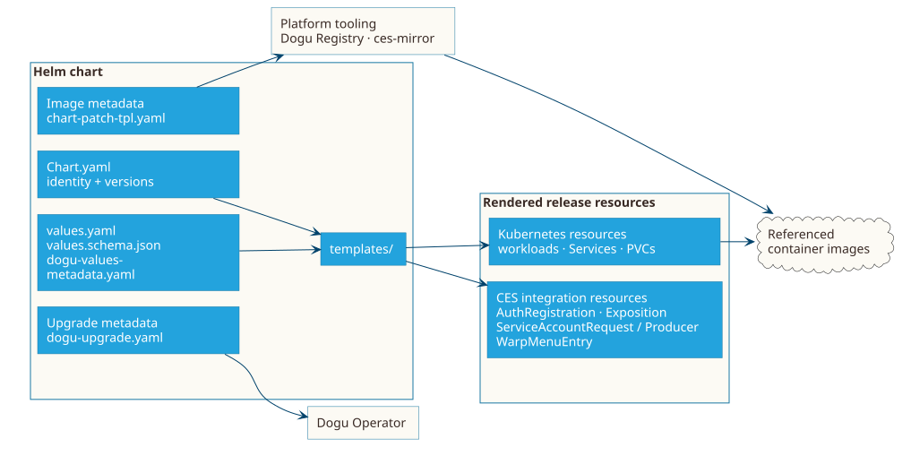
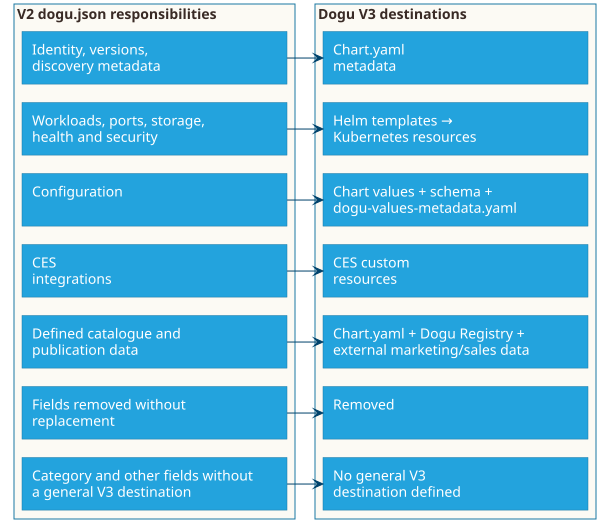

# Understand Dogu V3 Artifacts

A Dogu V3 is a Helm chart. Think of the chart as the package that keeps the Dogu's identity, configuration interface, workload definitions and optional CES integrations together. Container images remain separate artifacts referenced by that package.

## The chart is the leading artifact

`Chart.yaml` identifies the package. Its `version` is the **Dogu version** and follows the chart lifecycle. `appVersion` is the version of the packaged upstream application; it is informative and can differ. A packaging fix can therefore change `version` without changing `appVersion`.

The accepted metadata set includes standard Helm fields and Dogu annotations. In particular, `name`, `version`, `appVersion`, `description` and `annotations.dogu.cloudogu.com/api-version` are required by the target architecture. The [artifact compendium](../reference/compendium.md) records the detailed status and contract for each artifact.

## Configuration belongs to the package

- `values.yaml` supplies safe defaults and is the chart's configuration interface.
- `values.schema.json` validates the final values accepted by Helm.
- `dogu-values-metadata.yaml` maps CES-wide configuration keys to values when such mappings are needed. It is optional for a Dogu without configurable values.

These files complement one another: defaults are not validation, and validation is not a CES mapping. Do not put credentials into values.

## Templates become the running Dogu

Files below `templates/` render ordinary Kubernetes resources: for example Deployments or StatefulSets, Services, probes, PVCs, ConfigMaps and Secret references. When the application needs a CES capability, the same chart can render the corresponding integration resource:

- `AuthRegistration` for CES authentication;
- `Exposition` for external access;
- `ServiceAccountRequest` or `ServiceAccountProducer` for technical credentials; and
- `WarpMenuEntry` for a shared-menu entry.

These declarations describe relationships and intent. Their runtime reconciliation, status and routing details belong to [the Multinode runtime environment](multinode-environment.md).

## Companion files and images

In the accepted V3 target architecture, `chart-patch-tpl.yaml` supplies the Dogu Registry and mirroring tools with all container-image references used by the chart. This includes application, sidecar, init-container, dependency and external images. `ces-mirror` uses these references to mirror images and rewrite them for the target registry.

## How Dogu V3 replaces `dogu.json`

V3 does not have a project-local `dogu.json`. Its former responsibilities move to standard chart metadata, chart values and schemas, rendered Kubernetes resources, companion files, CES custom resources, or the Dogu Registry API. Some deprecated or generic V2 fields are removed. For other fields, the accepted architecture does not define a general V3 replacement. The artifact compendium explains the destination of every V2 field.

The complete field-by-field disposition is in the [artifact compendium](../reference/compendium.md).

## Take care when renaming Kubernetes resources

Changing `metadata.name` creates a different Kubernetes object. The impact depends on the resource and its controller: references can break, a controller can issue new credentials, and stateful resources can become disconnected or orphaned. A rename does not by itself mean that Kubernetes deletes the underlying data.

Before changing a name, check these relationships:

| Relationship | Typical risk |
| --- | --- |
| PVC and claim references | A workload fails to start if the referenced claim does not exist. A new claim can bind different storage; whether the previous volume and its underlying storage remain after the old claim is deleted depends on the PersistentVolume reclaim policy. |
| Service, clients and selectors | Clients and `Exposition` resources can continue to reference the old Service; selector changes can also leave a Service without endpoints. |
| Exposition target | External access can point to a Service or port that no longer exists. |
| ServiceAccountRequest and managed Secret | A new request can regenerate credentials while the application still expects the old Secret. |
| Other integration resources | Authentication or menu integration can be duplicated, replaced or disconnected. |
| Backup and retention | Verify selection labels and restore or retention behavior for the affected resource. |

Treat renames of stateful or externally referenced resources as **migrations**: update every reference, verify backup and retention behavior, and retire the old object only after the new path has been validated.

## Where to continue

- The [artifact compendium](../reference/compendium.md) explains which artifacts are required, who is responsible for them and where to find their documentation.
- Read [the Multinode runtime environment](multinode-environment.md) for what happens after chart resources are installed.
