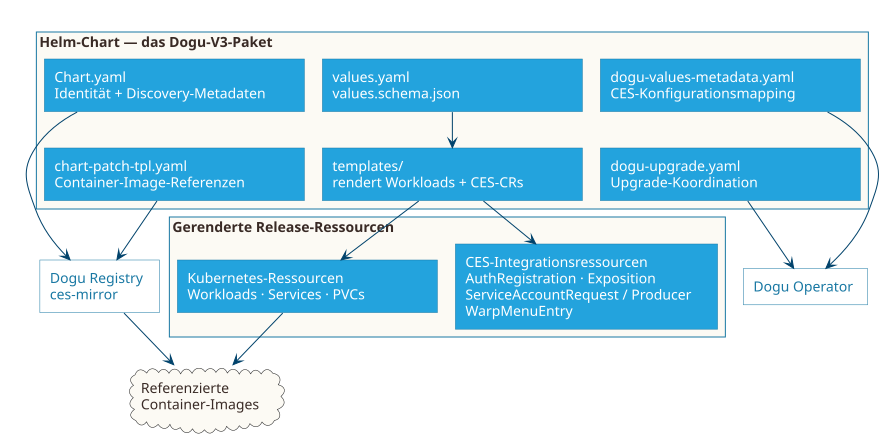
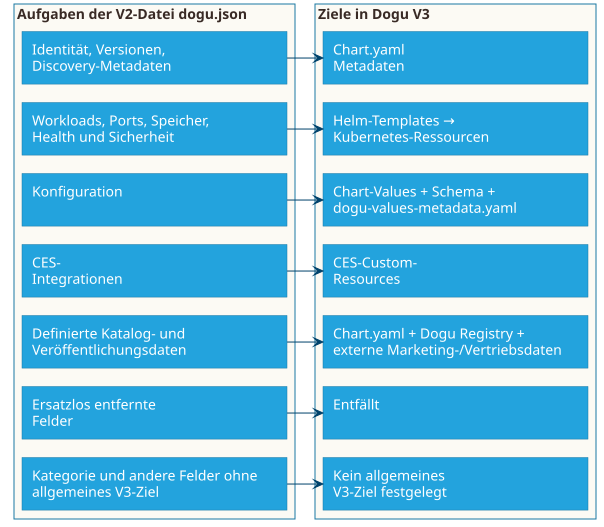

# Dogu-V3-Artefakte verstehen

Ein Dogu V3 ist ein Helm-Chart. Das Chart ist das Paket, das Identität, Konfigurationsschnittstelle, Workload-Definitionen und optionale CES-Integrationen eines Dogus zusammenhält. Container-Images bleiben separate Artefakte, auf die dieses Paket verweist.

## Das Chart ist das führende Artefakt

`Chart.yaml` identifiziert das Paket. Die `version` ist die **Dogu-Version** und folgt dem Chart-Lebenszyklus. `appVersion` bezeichnet informativ die Version der verpackten Herstelleranwendung und darf abweichen. Eine reine Packaging-Korrektur kann daher `version` ändern, ohne `appVersion` zu ändern.

Die akzeptierte Metadatenmenge umfasst Helm-Standardfelder und Dogu-Annotationen. Insbesondere sind `name`, `version`, `appVersion`, `description` und `annotations.dogu.cloudogu.com/api-version` in der Zielarchitektur verpflichtend. Das [Artefakt-Kompendium](../reference/compendium_de.md) beschreibt die Aufgabe und Verwendung jedes Artefakts.

## Konfiguration gehört in das Paket

- `values.yaml` liefert sichere Standardwerte und ist die Konfigurationsschnittstelle des Charts.
- `values.schema.json` validiert die endgültigen, von Helm angenommenen Values.
- `dogu-values-metadata.yaml` ordnet bei Bedarf CES-weite Konfigurationsschlüssel Chart-Values zu. Für ein Dogu ohne konfigurierbare Werte ist die Datei optional.

Die Dateien ergänzen einander: Standardwerte sind keine Validierung, und Validierung ist keine CES-Zuordnung. Credentials gehören nicht in Values.

## Templates werden zum laufenden Dogu

Dateien unter `templates/` rendern normale Kubernetes-Ressourcen, beispielsweise Deployments oder StatefulSets, Services, Probes, PVCs, ConfigMaps und Secret-Referenzen. Benötigt die Anwendung eine CES-Funktion, kann dasselbe Chart die passende Integrationsressource rendern:

- `AuthRegistration` für CES-Authentifizierung,
- `Exposition` für externen Zugriff,
- `ServiceAccountRequest` oder `ServiceAccountProducer` für technische Credentials und
- `WarpMenuEntry` für einen Eintrag im gemeinsamen Menü.

Diese Deklarationen beschreiben Beziehungen und Absicht. Laufzeit-Reconciliation, Status und Routing-Details erklärt [die Multinode-Laufzeitumgebung](multinode-environment_de.md).

## Begleitdateien und Images

In der akzeptierten V3-Zielarchitektur stellt `chart-patch-tpl.yaml` der Dogu Registry und den Spiegelungswerkzeugen alle vom Chart verwendeten Container-Image-Referenzen bereit. Dazu gehören Anwendungs-, Sidecar-, Init-Container-, Abhängigkeits- und externe Images. `ces-mirror` verwendet diese Referenzen, um Images zu spiegeln und für die Ziel-Registry umzuschreiben.

## Wie Dogu V3 die `dogu.json` ersetzt

V3 besitzt keine projektlokale `dogu.json`. Deren bisherige Aufgaben wandern in Standard-Chart-Metadaten, Chart-Values und Schemata, gerenderte Kubernetes-Ressourcen, Begleitdateien, CES-Custom-Resources oder die Dogu-Registry-API. Einige veraltete oder generische V2-Felder entfallen. Für andere Felder definiert die akzeptierte Architektur keinen allgemeinen V3-Ersatz. Das Artefakt-Kompendium erklärt das Ziel jedes V2-Feldes.

Die vollständige Zuordnung jedes Feldes enthält das [Artefakt-Kompendium](../reference/compendium_de.md).

## Vorsicht beim Umbenennen von Kubernetes-Ressourcen

Eine Änderung von `metadata.name` erzeugt ein anderes Kubernetes-Objekt. Die Auswirkungen hängen von Ressourcenart und Controller ab: Referenzen können ungültig werden, ein Controller kann neue Credentials ausstellen und zustandsbehaftete Ressourcen können getrennt oder verwaist werden. Aus einer Umbenennung folgt nicht automatisch, dass Kubernetes die zugrunde liegenden Daten löscht.

Prüfen Sie vor einer Namensänderung diese Beziehungen:

| Beziehung | Typisches Risiko |
| --- | --- |
| PVC- und Claim-Referenzen | Ein Workload startet nicht, wenn der referenzierte Claim fehlt. Ein neuer Claim kann an einen anderen Speicher gebunden werden; ob das bisherige Volume und der zugrunde liegende Speicher nach dem Löschen des alten Claims erhalten bleiben, hängt von der Reclaim Policy des PersistentVolume ab. |
| Service, Clients und Selektoren | Clients und `Exposition`-Ressourcen können weiterhin den alten Service referenzieren; geänderte Selektoren können außerdem dazu führen, dass ein Service keine Endpoints mehr besitzt. |
| Exposition-Ziel | Externer Zugriff kann auf einen nicht mehr vorhandenen Service oder Port zeigen. |
| ServiceAccountRequest und verwaltetes Secret | Ein neuer Request kann Credentials neu erzeugen, während die Anwendung noch das alte Secret erwartet. |
| Andere Integrationsressourcen | Authentifizierungs- oder Menüintegration kann dupliziert, ersetzt oder getrennt werden. |
| Backup und Aufbewahrung | Prüfen Sie Selektionslabels sowie Restore- und Aufbewahrungsverhalten der betroffenen Ressource. |

Behandeln Sie die Umbenennung zustandsbehafteter oder extern referenzierter Ressourcen als **Migration**: Aktualisieren Sie alle Referenzen, prüfen Sie Backup- und Aufbewahrungsverhalten und entfernen Sie das alte Objekt erst, nachdem der neue Pfad validiert wurde.

## So geht es weiter

- Im [Artefakt-Kompendium](../reference/compendium_de.md) erfahren Sie, welche Artefakte benötigt werden, wer dafür verantwortlich ist und wo die zugehörige Dokumentation zu finden ist.
- Lesen Sie [die Multinode-Laufzeitumgebung](multinode-environment_de.md), um zu verstehen, was nach der Installation der Chart-Ressourcen geschieht.
