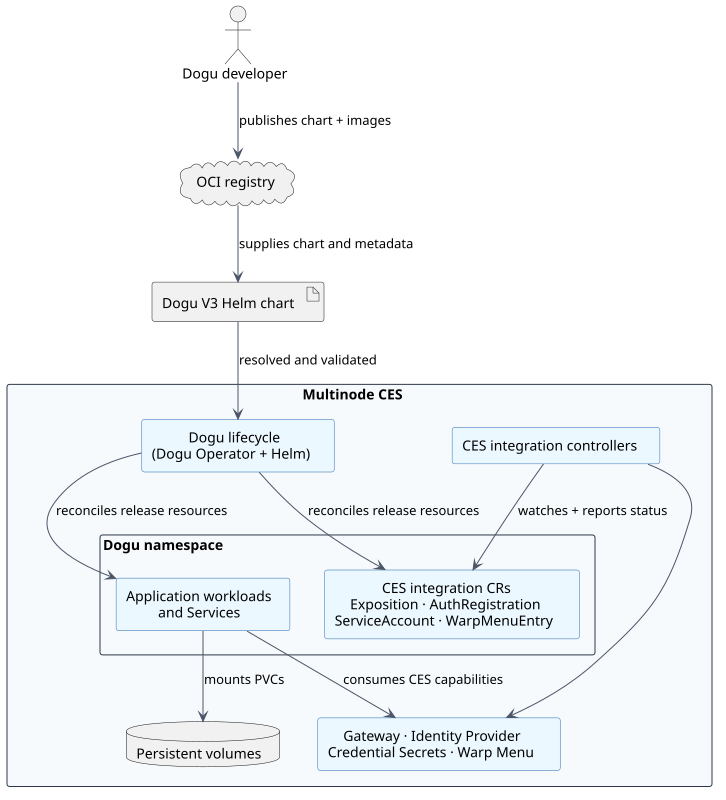
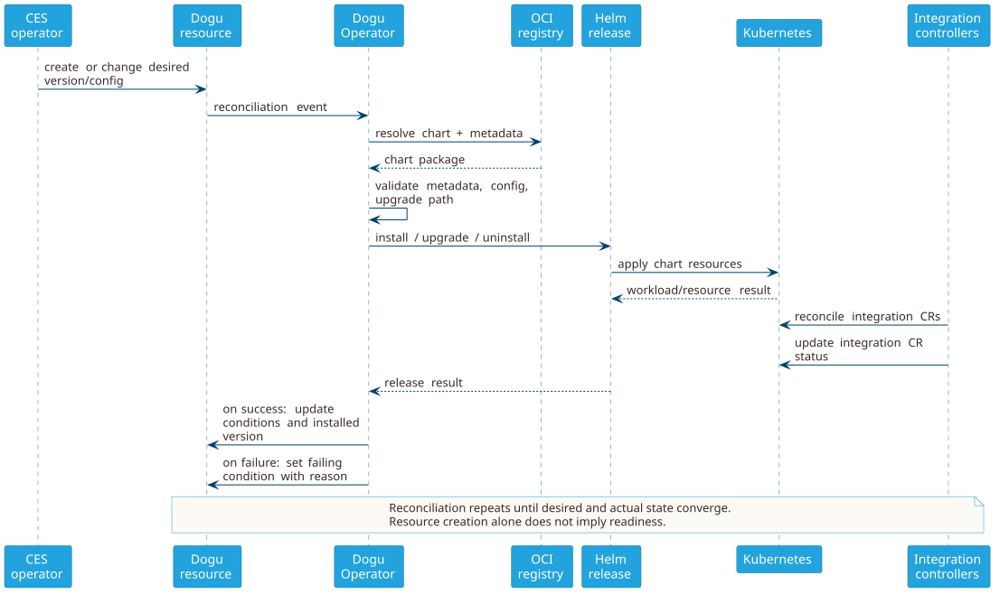
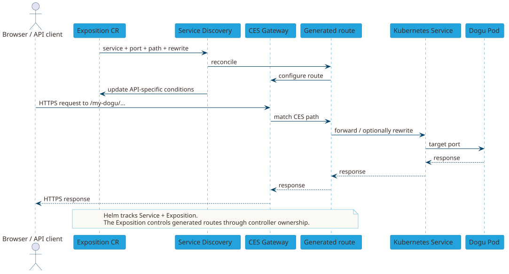

# Die Multinode-Laufzeitumgebung verstehen

Ein Dogu V3 wird als Helm-Chart ausgeliefert und läuft als namensraumgebundene Anwendung in einem Multinode Cloudogu EcoSystem (CES). Das Chart beschreibt die Anwendungs-Workloads und kann über Kubernetes-Custom-Resources gezielt CES-Funktionen nutzen.

Diese Seite erklärt die daraus entstehenden Verantwortlichkeiten und Interaktionen. Sie ist keine allgemeine Kubernetes- oder Helm-Einführung.

## Das mentale Modell



Die Verantwortlichkeiten sind bewusst getrennt:

| Bereich | Dogu-Chart | CES-Plattform |
| --- | --- | --- |
| Anwendung | Definiert Deployments, StatefulSets, Jobs, Container, Probes und interne Services | Plant und betreibt die resultierenden Kubernetes-Ressourcen |
| Lebenszyklus | Liefert Chart-Metadaten, Standardwerte, Validierung und optionale Migrationslogik | Ermittelt das Chart, validiert den gewünschten Übergang und reconciled das Helm-Release |
| Konfiguration | Definiert unterstützte Values, sichere Standardwerte und ein Schema | Liefert instanzspezifische Values über die Dogu-Ressource |
| Persistente Daten | Definiert die benötigten PVCs und Volume-Mounts | Stellt konfigurierte StorageClasses bereit und bindet Volumes |
| Externer Zugriff | Definiert einen Service und bei Bedarf eine `Exposition` | Reconciled Gateway-Routen und externe Ports |
| Authentifizierung | Definiert eine `AuthRegistration` und verwendet deren Credential-Secret | Registriert den Client beim Identity Provider und veröffentlicht Credentials |
| Technischer Zugriff auf einen anderen CES-Dienst | Definiert einen `ServiceAccountRequest` oder beim Anbieten eines Zugangs einen `ServiceAccountProducer` | Vermittelt die Credential-Erzeugung und speichert Credentials in einem Secret |
| Warp-Menü | Definiert null oder mehrere `WarpMenuEntry`-Ressourcen für interne Anwendungsseiten | Validiert die Einträge und rendert das gemeinsame Menü |

Das Chart bleibt dafür verantwortlich, dass die Anwendung funktioniert. CES-Controller stellen Integrationen bereit; sie leiten keine fehlende Anwendungskonfiguration aus einem Container-Image ab.

## Namespace und Kubernetes-Kontext

Ein Dogu und seine namensraumgebundenen Ressourcen werden gemeinsam in dem vom CES gewählten Namespace installiert. Ein Chart muss deshalb unabhängig vom konkreten Namespace sein:

- Verwenden Sie `.Release.Namespace`, statt `ecosystem` oder einen anderen Namespace fest einzutragen.
- Leiten Sie Namen aus `.Release.Name` und Chart-Helper-Templates ab, statt einen festen Helm-Release-Namen anzunehmen.
- Referenzieren Sie Services, ConfigMaps, Secrets und Custom Resources innerhalb des Release-Namespace, sofern eine dokumentierte API nichts anderes vorgibt.
- Leiten Sie Anwendungsverhalten niemals aus dem lokalen `kubectl`-Kontext einer entwickelnden Person ab.

Prüfen Sie bei der Diagnose eines Clusters zuerst den Kontext und geben Sie den Namespace immer explizit an:

```shell
kubectl config current-context
kubectl get dogu -A
kubectl -n <dogu-namespace> get pods,services,pvc
```

Der Dogu-Registry-Namespace in einem Namen wie `official/my-dogu`, der OCI-Repository-Pfad und der Kubernetes-Laufzeit-Namespace sind unterschiedliche Konzepte. Keines davon darf als Ersatz für ein anderes verwendet werden.

## Helm-Release und Dogu-Lebenszyklus

Die Dogu-Custom-Resource beschreibt den Sollzustand aus Sicht der Plattform. Das Helm-Release ist der Mechanismus, der diesen Zustand umsetzt. Operatoren oder Administrator:innen ändern die Dogu-Ressource; das daraus erzeugte Helm-Release darf nicht direkt verändert werden.



Der vorgesehene Ablauf ist:

1. Eine Dogu-Ressource fordert ein Dogu und eine Chart-Version an.
2. Der Dogu Operator ermittelt und validiert das Chart und seine Metadaten.
3. Helm validiert die zusammengeführten Values und installiert oder aktualisiert das Release.
4. Kubernetes startet die Workloads aus dem Chart.
5. CES-Controller reconciliieren die Integrationsressourcen unabhängig voneinander.
6. Statusinformationen an der Dogu- und den Integrationsressourcen melden Fortschritt oder Fehler.

Reconciliation läuft kontinuierlich. Ein erfolgreiches `helm template` oder die bloße Existenz einer Ressource bedeuten noch nicht, dass das Dogu bereit ist. Auch Workloads, PVCs und jede benötigte Integration müssen bereit werden.

### Upgrades

Die Dogu-Version entspricht der Chart-`version`; `appVersion` enthält die Version der verpackten Anwendung. Beide Versionen dürfen voneinander abweichen. In der akzeptierten Zielarchitektur beschreibt `dogu-upgrade.yaml` gültige Übergänge zwischen Dogu-/Chart-Versionen und Parameter, die der Dogu Operator zur Koordination eines Upgrades benötigt. Ein Chart kann Migrationslogik durch Kubernetes-native Mechanismen wie Init-Container oder Helm-Hook-Jobs bereitstellen. Migrationslogik muss:

- nach einem Neustart von Pod, Job oder Controller sicher wiederholbar sein,
- Quell- und Zielversion des Dogus/Charts sowie relevante Anwendungsversionen explizit berücksichtigen,
- mit den Volume-Access-Modes des Charts kompatibel sein,
- durch aussagekräftige Job-Logs und Workload-Status beobachtbar sein.

Der Operator muss Values und Workload-Skalierung koordinieren, wenn Migrationscontainer oder Hook-Jobs auf bestehende Workloads oder `ReadWriteOnce`-Volumes zugreifen. Verlassen Sie sich nicht darauf, dass die Plattform V2-`pre-upgrade.sh`- oder `post-upgrade.sh`-Skripte ausführt. Ein V3-Chart liefert seine Migrationsimplementierung, eigenständige Helm-Hooks sind aber noch kein einsetzbarer V3-Lebenszyklusvertrag.

### Reconciliation und Status

Untersuchen Sie vor Controller-Interna zuerst den Status:

```shell
kubectl -n <dogu-namespace> get dogu <dogu-name> -o yaml
kubectl -n <dogu-namespace> get exposition,authregistration,serviceaccountrequest,warpmenuentry
kubectl -n <dogu-namespace> describe <kind> <name>
```

Die APIs verwenden keine gemeinsame Readiness-Condition. Prüfen Sie ihre API-spezifischen Erfolgsbedingungen:

- Exposition: je nach Nutzung `Valid`, `IngressesReady`, `NetworkPolicyReady`, `IngressTCPRoutesCreated`, `IngressUDPRoutesCreated` und `LoadBalancerPortsAllocated`,
- AuthRegistration: `Completed` und `CredentialsPublished`,
- ServiceAccountRequest: `ServiceAccountReady` und
- WarpMenuEntry: `Ready` und `Visible`.

Verwenden Sie `metadata.generation`, Condition-`status`, `reason`, `message` und `observedGeneration`, sofern die API das jeweilige Feld bereitstellt. Eine vorhandene Ressource ohne ihre API-spezifischen Erfolgsbedingungen ist noch nicht erfolgreich integriert.

## Konfiguration

Behandeln Sie die `values.yaml` als öffentliche Konfigurationsschnittstelle des Charts:

1. Stellen Sie sichere Standardwerte bereit, sodass eine normale Installation wenige Overrides benötigt.
2. Dokumentieren Sie Values, die Partner oder Instanzbetreiber:innen ändern sollen.
3. Validieren Sie die endgültige Value-Struktur mit `values.schema.json`.
4. Verwenden Sie `dogu-values-metadata.yaml` für CES-weit abgebildete Einstellungen wie den Root-Loglevel, wenn der V3-Vertrag dies verlangt.

Instanzspezifische Overrides werden über die Dogu-Ressource geliefert und durch die Plattform zusammengeführt. Verlangen Sie nicht, dass Betreiber:innen nach der Installation Deployments, StatefulSets oder Helm-Release-Secrets patchen; Reconciliation kann solche Änderungen überschreiben.

Passwörter, Tokens und private Schlüssel dürfen weder in `values.yaml` committed noch in ConfigMaps gerendert werden. Verwenden Sie ein namensraumgebundenes Kubernetes-Secret oder ein Credential-Secret eines CES-Integrationscontrollers. Die V3-Architektur definiert aktuell keinen einheitlichen Mechanismus für sensitive Values; dokumentieren Sie deshalb jeden Secret-Vertrag im Chart.

## Storage und PVCs

V3-Charts definieren die benötigten Kubernetes-PVCs und Volume-Mounts selbst. Anders als bei V2 kann ein Dogu mehrere Volumes verwenden, beispielsweise getrennt für Anwendung und Datenbank.

Dokumentieren Sie für jeden PVC:

- welche Daten er enthält,
- welcher Workload ihn verwendet,
- den benötigten Access Mode,
- die Standardgröße und
- ob `storageClassName` konfigurierbar ist.

Tragen Sie keine clusterspezifische StorageClass fest ein. Legen Sie fest und testen Sie, ob persistente Daten bei einer Deinstallation erhalten bleiben sollen.

## Service-Exposition und Request-Routing

Eine Anwendung bleibt clusterintern, bis das Chart externen Zugriff deklariert. Erstellen Sie einen normalen Kubernetes-Service für den Ziel-Workload und eine oder mehrere [`Exposition`](https://github.com/cloudogu/k8s-exposition-lib)-Ressourcen mit den benötigten HTTP-, TCP- oder UDP-Routen. Erstellen Sie keine plattformspezifischen Ingress- oder Traefik-Ressourcen direkt.



Bei HTTP-Routen bezeichnet die Exposition den Ziel-Service und -Port, den CES-relativen Pfad und ein optionales Path-Rewrite. Anwendungen müssen unter einem Pfad wie `/my-dogu` funktionieren; sie dürfen nicht voraussetzen, unter `/` zu laufen. Verwenden Sie TCP- oder UDP-Exposition nur, wenn das Anwendungsprotokoll nicht über das HTTP-Gateway laufen kann. Angeforderte externe Ports können kollidieren; `LoadBalancerPortsAllocated` und dessen Begründung zeigen, ob die Zuweisung erfolgreich war.

Der Service-Discovery-Controller besitzt die erzeugten Gateway-Ressourcen. Helm verfolgt den vom Dogu-Chart gerenderten Service und die Exposition; das Chart darf die erzeugten Routen nicht patchen.

## Identity Provider und Authentifizierung

Um am CES-Single-Sign-on teilzunehmen, deklarieren Sie eine [`AuthRegistration`](https://github.com/cloudogu/k8s-auth-registration-lib) (`k8s.cloudogu.com/v1`). Sie enthält das Protokoll (`CAS`, `OIDC` oder `OAUTH`), den Consumer sowie optional Logout-URL und Parameter.

Der Authentifizierungscontroller registriert den Client und veröffentlicht Credentials in einem Secret. Mounten oder lesen Sie dieses Secret in der Anwendung; duplizieren Sie die Credentials niemals in Chart-Values. Zur Fehleranalyse dienen `status.resolvedSecretRef` sowie die Conditions `Completed` und `CredentialsPublished`.

Eine AuthRegistration provisioniert nur die clientseitige Integration. Die Anwendung muss das ausgewählte Authentifizierungsprotokoll weiterhin selbst implementieren, CES-pfadkompatible Callback-/Logout-URLs bilden und mit nicht verfügbaren oder rotierten Credentials umgehen.

## Zwei Arten von Service-Accounts

### Kubernetes-Workload-ServiceAccount

Ein Kubernetes-`ServiceAccount` gibt einem Pod Zugriff auf die Kubernetes-API. Erstellen Sie ihn nur, wenn die Anwendung diesen Zugriff benötigt. Verwenden Sie einen namensraumgebundenen ServiceAccount, setzen Sie `serviceAccountName` am Workload und gewähren Sie über eine Role nur die erforderlichen Rechte. Vermeiden Sie clusterweite RBAC.

### CES-Service-Account-Credentials

Ein [`ServiceAccountRequest`](https://github.com/cloudogu/k8s-serviceaccount-lib) (`k8s.cloudogu.com/v2`) fordert technische Credentials eines anderen Dogus oder einer Komponente an. Der Service Account Operator stellt sie in einem verwalteten Secret bereit.

Die konsumierende Anwendung muss:

- den dokumentierten Parameter- und Secret-Key-Vertrag des Producers einhalten,
- optionale Credential-Secrets mit `optional: true` mounten,
- bei Secret-Rotation die Credentials neu laden oder den Workload neu starten und
- das verwaltete Secret unverändert lassen.

Ein Dogu, das Accounts anbietet, muss einen `ServiceAccountProducer` deklarieren und die [Producer-API](https://github.com/cloudogu/service-account-producer-sidecar) implementieren. Container desselben Dogus benötigen diesen CES-weiten Mechanismus normalerweise nicht. Wenn Credentials fehlen, prüfen Sie `ServiceAccountReady`.

## Warp-Menü

Deklarieren Sie einen [`WarpMenuEntry`](https://github.com/cloudogu/k8s-warp-menu-entry-lib) (`k8s.cloudogu.com/v1`) für jeden internen, für Benutzer:innen sichtbaren Einstiegspunkt. Ein Dogu darf keinen oder mehrere Einträge besitzen.

Jeder Eintrag enthält deutsche und englische Anzeigenamen, einen Kategorie-Key und einen CES-relativen Pfad. Externe URLs sind bewusst nicht erlaubt; sie werden zentral von der Plattform kontrolliert. Mit `disabled: true` bleibt eine Deklaration erhalten, ohne gerendert zu werden. Die Status-Conditions `Ready` und `Visible` helfen bei der Diagnose eines fehlenden Eintrags.

Das Warp-Menü exponiert die Anwendung nicht. Sein Pfad muss zu einer unabhängig funktionierenden HTTP-Exposition passen.

## Labels und Selektoren

Verwenden Sie die empfohlenen Kubernetes-App-Labels konsistent auf den Ressourcen des Charts:

```yaml
app.kubernetes.io/name: <dogu-name>
app.kubernetes.io/instance: <release-name>
app.kubernetes.io/version: <application-version>
app.kubernetes.io/managed-by: <release-service>
helm.sh/chart: <chart-name>-<chart-version>
```

Verwenden Sie für Workload-Selektoren nur stabile Identitätslabels wie `app.kubernetes.io/name` und `app.kubernetes.io/instance`. Versions- und Chart-Labels dürfen nicht Teil eines Selektors sein, da sich ihre Werte bei einem Upgrade ändern.

Verwenden Sie keine allgemeinen Labels wie `app: ces`, um Ressourcen eines bestimmten Dogus auszuwählen. Fügen Sie Dogu-spezifische Labels nur hinzu, wenn ein dokumentierter CES-Vertrag dies verlangt.

## Ressourcenverantwortung

Jede Ressource sollte von genau einer Stelle verwaltet werden:

- Definieren Sie Anwendungs- und CES-Integrationsressourcen im Chart. Helm verwaltet diese Ressourcen.
- Integrationscontroller verwalten die von ihnen erzeugten Ressourcen, beispielsweise Gateway-Routen oder Credential-Secrets. Nehmen Sie diese erzeugten Ressourcen nicht in das Chart auf und verändern Sie sie nicht manuell.
- Übernehmen Sie bestehende Secrets oder PVCs nur mit einem dokumentierten Verfahren.

Dokumentieren und testen Sie das Löschverhalten persistenter oder extern verwalteter Ressourcen.

## Checkliste vor einem Release

Prüfen Sie vor der Übergabe eines Charts oder dem Test in einem Partner-CES:

- [ ] Das Chart rendert mit beliebigen Release-Namen und Namespaces und `values.schema.json` validiert seine Values.
- [ ] Workloads definieren Probes, Resource-Requests und -Limits sowie stabile Selektoren.
- [ ] Storage- und Deinstallationsverhalten sind dokumentiert und getestet.
- [ ] Externe Pfade verwenden Exposition-Ressourcen und Warp-Menü-Pfade funktionieren.
- [ ] Credentials für Authentifizierung und technische Accounts werden aus Secrets verwendet, ohne offengelegt zu werden.
- [ ] Jede vom Dogu verwendete CES-Integration meldet einen erfolgreichen Status.
- [ ] Installation, Upgrades, Reconciliation nach Konfigurationsänderungen und Deinstallation sind gegen die vorgesehene CES-Version getestet.
