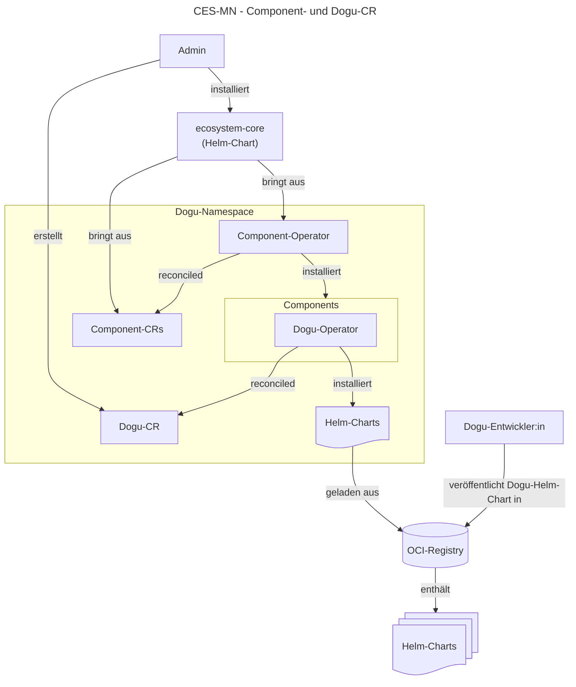
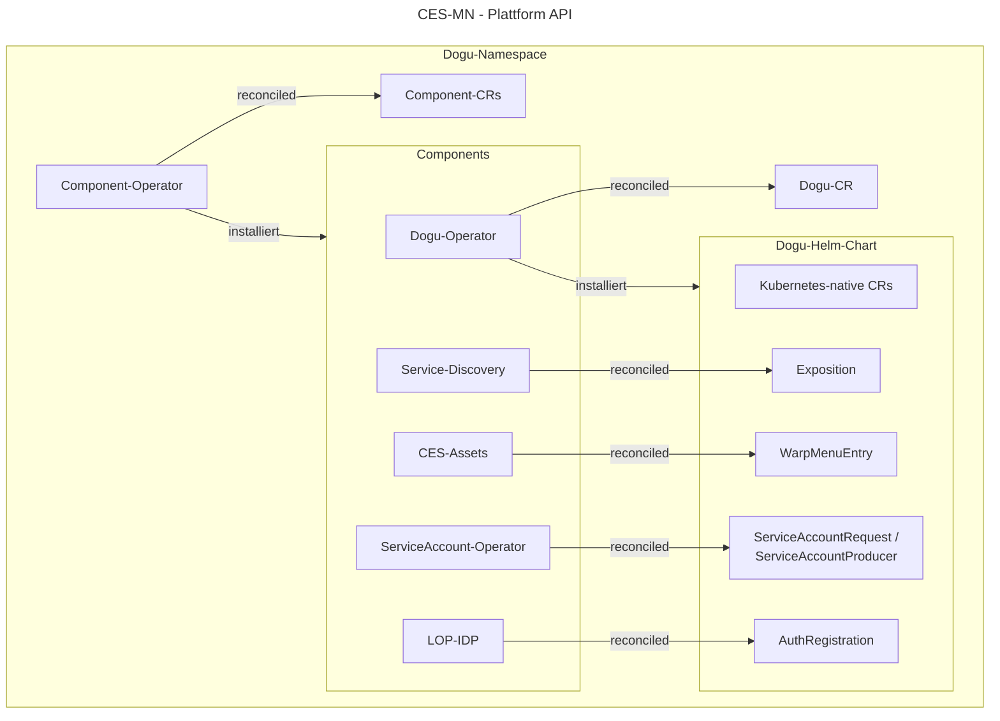

# Die Multinode-Laufzeitumgebung verstehen

Dieses Dokument beschreibt, wie die Laufzeitumgebung der Multinode-Variante des Cloudogu EcoSystems (CES-MN) aufgebaut ist, und führt durch ihre zentralen Konzepte – von der Architektur über Lebenszyklus, Konfiguration, Storage und Networking bis hin zur Anbindung von Dogus an die Plattform.

Für die MultiNode-Variante des Cloudogu EcoSystems (CES-MN) dient Kubernetes als verteilte, hochverfügbare Laufzeitumgebung, 
die eine dynamische Skalierung und Ausfallsicherheit über mehrere Cluster-Knoten hinweg gewährleistet. Die Plattform nutzt
Custom Resource Definitions (CRDs), um Kubernetes-native Abstraktionen für die Verwaltung der gesamten Plattform zu schaffen.
Sie erweitern die Kubernetes-API und ermöglichen es den Cloudogu eigenen Operatoren, den gewünschten Zielzustand der Plattform deklarativ herzustellen.

## Zentrale Bestandteile

In CES-MN werden grundsätzlich drei zentralen Top-Tier CRDs genutzt, die das Herzstück der Architektur bilden.

### Dogu-CRD

Die Dogu-CRD beschreibt eine einzelne Anwendung innerhalb des CES (wie z. B. SCM-Manager, Jenkins, Redmine oder SonarQube).

- **Aufgabe**: Sie dient als Deklaration für die Installation, Konfiguration und den Lebenszyklus eines einzelnen Dogus im Kubernetes-Cluster.
- **Verwaltung durch**: Den [Dogu-Operator](https://github.com/cloudogu/k8s-dogu-operator/blob/main/docs/operations/overview_de.md).
- **Funktionsweise**: Wenn ein Dogu-Objekt im Cluster angelegt oder verändert wird, kümmert sich der Operator darum, das dem Dogu zugehörige Helm-Chart im Cluster auszuliefern.
Das Chart stellt die Workloads bereit und lässt sich über CRDs gezielt an die Plattform anbinden, z.B. Anbindung an SSO oder Integration ins zentrale Warp-Menü.

### Component-CRD

Während ein Dogu eine Benutzer-Anwendung darstellt, repräsentiert eine Component einen System- oder Infrastruktur-Baustein, der für den Betrieb der Plattform selbst erforderlich ist.

- **Aufgabe**: Verwaltung von Kern-Diensten wie dem Identity Provider, Monitoring oder Cloudogu internen Operatoren für die Plattformanbindung.
- **Verwaltung durch**: Den [Component-Operator](https://github.com/cloudogu/k8s-component-operator/blob/main/docs/operations/managing_components_de.md).
- **Unterschied zum Dogu**: Komponenten sind tiefer im Cluster integriert und bilden das Fundament, auf dem die Dogus überhaupt erst laufen können. 
Sie kapseln Helm-Charts, um Basisfunktionalitäten konsistent bereitzustellen.

Component-CRs werden in der Regel nicht durch den Endanwender installiert, sondern werden über den [Ecosytem-Core](https://github.com/cloudogu/ecosystem-core/blob/main/docs/operations/configuration_de.md)
verwaltet. Ecosystem-Core ist ein Helm-Chart, das die Kernkomponenten installiert, die für die Ausführung des CES-MN erforderlich sind.

### Blueprint-CRD

Die Blueprint-CRD steht hierarchisch über den einzelnen Dogus und bildet die komplette Dogu-Landschaft eines Mandanten ab.

- **Aufgabe**: Sie definiert das gewünschte Gesamtsystem (einen „Bauplan“ / Blueprint), also welche Kombinationen aus dogus in welchen Versionen und Konfigurationen installiert sein sollen.
- **Verwaltung durch**: Den [Blueprint-Operator](https://github.com/cloudogu/k8s-blueprint-operator/blob/main/docs/operations/explanation/introduction_de.md).
- **Funktionsweise**: Ein Blueprint ermöglicht die automatisierte, reproduzierbare Bereitstellung kompletter Umgebungen. 

Wenn die Blueprint-CR verarbeitet wird, erzeugt der Operator die Dogu-Ressourcen im Cluster und stellt sicher, dass die gesamte Plattform im gewünschten Zielzustand aufgebaut wird.
Die Nutzung von Blueprints im CES ist optional.

## Namespace und Mandantentrennung

In der aktuellen Architektur von CES-MN werden alle Dogus und Systemkomponenten gemeinsam in einem einzelnen Namespace bereitgestellt. Da ein Cluster derzeit genau einen Mandanten bedient, ist echtes Multi-Tenancy auf derselben Cluster-Instanz aktuell ausgeschlossen. Jede Mandantenumgebung erfordert somit ein dediziertes Kubernetes-Cluster, was eine strikte und sichere Mandantentrennung auf Infrastrukturebene gewährleistet. 

Obwohl eine Trennung hinsichtlich der Namespaces auf den ersten Blick eine effiziente Ressourcennutzung verspricht, scheitert sie am Fehlen einer echten Infrastrukturgrenze. Durch gemeinsam genutzte Ressourcen bleiben Risiken wie Container-Breakouts oder Ressourcen-Engpässe durch andere Mandanten bestehen. Für Architekturen wie dem CES-MN bedeutet die Entscheidung für dedizierte Cluster pro Mandant zwar einen höheren Betriebsaufwand, sichert jedoch eine kompromisslose, infrastrukturseitige Isolation, die sowohl strikte Compliance-Vorgaben erfüllt als auch das Risiko mandantenübergreifender Sicherheitsvorfälle minimiert.

## Lebenszyklus 

Sowohl die oben genannte Dogu-CR als auch Component-CR beschreiben den Sollzustand aus der Sicht der Plattform. Der Lebenszyklus 
des damit verbundenden Helm-Charts ist an die jeweilige CR gebunden. Wird die Dogu-Version innerhalb der CR hochgesetzt, so wird das das entsprechende Dogu aktualisiert (downgrades werden nicht unterstützt). Wird die CR gelöscht, wird das entsprechende Dogu bzw. 
die Komponente gelöscht. 

## Konfiguration

Als öffentliche Schnittstelle für die Konfiguration von Komponenten und Dogus wird die `values.yaml` der jeweiligen Helm-Charts
verwendet. Hierfür sollten geeignete Standardwerte bereitgestellt werden, sodass nur instanzspezifische Werte in den Values überschrieben
werden müssen. Instanzspezifische Overrides werden über die Component-, Dogu- oder Blueprint-CR geliefert und durch die Plattform zusammengeführt.

Konfigurationen sollten stets an der CR vorgenommen werden und nicht an den über Helm ausgebrachten Ressourcen. Die Plattform überwacht 
den Sollzustand anhand der bereitgestellten CR und überschreibt etwaige Änderungen an den Ressourcen wieder über den Reconciliation-Loop der Operatoren.

## Storage und PVCs

Für den Betrieb von CES-MN wird im Cluster ein CSI-kompatibler Storage-Treiber und der Support für PVC-Vergrößerungen vorausgesetzt.
Darüber hinaus ist im Cluster bereits eine Standard Storage-Class definiert, sodass diese im PVC nicht definiert sein muss. 

Ein Dogu-Chart definiert die benötigten PVCs und Volume-Mounts selbst. Anders als bei der Dogu-API V2 kann ein Dogu mehrere Volumes verwenden, 
beispielsweise getrennt für Anwendung und Datenbank.

## Networking

Für das Networking in CES-MN wird ein [CNI](https://github.com/containernetworking/cni)-kompatibler Netzwerk-Treiber (Container Network Interface) eingesetzt. 
Die Plattform wurde erfolgreich mit [Calico](https://github.com/projectcalico/calico) und [Cilium](https://github.com/cilium/cilium) getestet. Zur Absicherung des Datenverkehrs zwischen Pods und Namespaces werden NetworkPolicies eingesetzt.
Um die Portabilität der Plattform zu gewährleisten und ein Vendor Lock-in bezüglich des CNI-Treibers zu vermeiden, dürfen ausschließlich Kubernetes-native NetworkPolicies (`apiVersion: networking.k8s.io/v1`) verwendet werden. 
Die Nutzung von treiberspezifischer CRDs für Netzwerkregeln sollte vermieden werden. 

## Plattformanbindung mittels Cloudogu CRDs

Um ein Dogu bzw. dessen Anwendung an das CES-MN anzubinden, werden mehrere CRDs zur Verfügung gestellt, die als API für die Plattform dienen.
Die CRDs stellen eine Abstraktion der darunterliegenden Technologie dar und gewährleisten eine stabile Schnittstelle. 
Sie kapseln die Komplexität der Infrastruktur ab, sodass Anpassungen an der verwendeten Technologie oder Änderungen in der Kubernetes-API 
ohne Beeinträchtigung des Gesamtsystems vorgenommen werden können. Folgende CRDs stehen für die Anbindung and die Plattform zur Verfügung:

- **AuthRegistration**: Registriert ein Dogu beim IdentityProvider für die Nutzung von Single Sign-On
- **WarpMenuEntry**: Erzeugt einen Eintrag im Warp-Menü, der zentralen Navigationsbar der Plattform
- **Exposition**: Exponiert den Service eines Dogus, sodass Routen oder Ports von außen erreichbar sind
- **ServiceAccountRequest**: Fordert technische Credentials eines anderen Dogus oder einer Komponente an
- **ServiceAccountProducer**: Definiert, wie ein ServiceAccount beim eigenen Dogu angefordert werden kann

Die Plattform-API sowie weitere Artefakte werden Dokument [Dogu Artefakte](docs/v3/concepts/artifacts_de.md) genauer beschrieben. 

## Bezugsquellen für Helm-Charts und Dogu Container Images

Die Helm-Charts für CES-MN sowie die benötigten Dogu Container Images stehen derzeit ausschließlich über
eine [private OCI Registry](https://registry.cloudogu.com/) zur Verfügung. Der Abruf und das Deployment dieser Artefakte 
erfolgt direkt über den Dogu-Operator sowie den Component-Operator, welche initial beim Aufsetzen der Plattform für den Zugriff auf die 
Registry konfiguriert werden.

Für Umgebungen ohne direkten Internetzugang (Air Gap) können sowohl die benötigten Helm-Charts als auch Container Images 
in eine interne OCI-Registry innerhalb der isolierten Umgebung gespiegelt werden.

## Systemdiagramm

Das folgenden Systemdiagramme veranschaulichen das Zusammenspiel einzelne CRs im Cluster: Der Admin installiert `ecosystem-core`, wodurch der Component-Operator
über Component-CRs die plattformseitigen Operatoren (inkl. Dogu-Operator) ausbringt. Parallel dazu erstellt der Admin eine
Dogu-CR, die vom Dogu-Operator reconciled wird. Dieser bezieht das zugehörige Helm-Chart aus der OCI-Registry. Das Chart enthält neben den Workloads auch die Plattform-API in Form von CRs, die jeweils vom zuständigen Operator reconciled werden.

---

