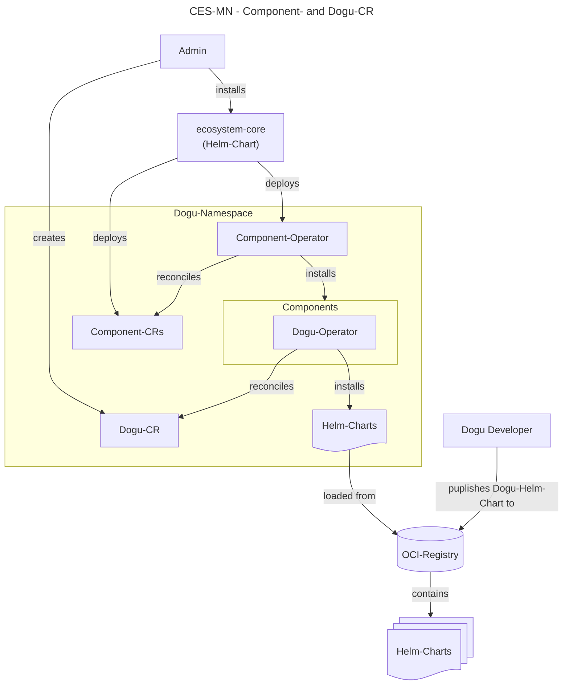
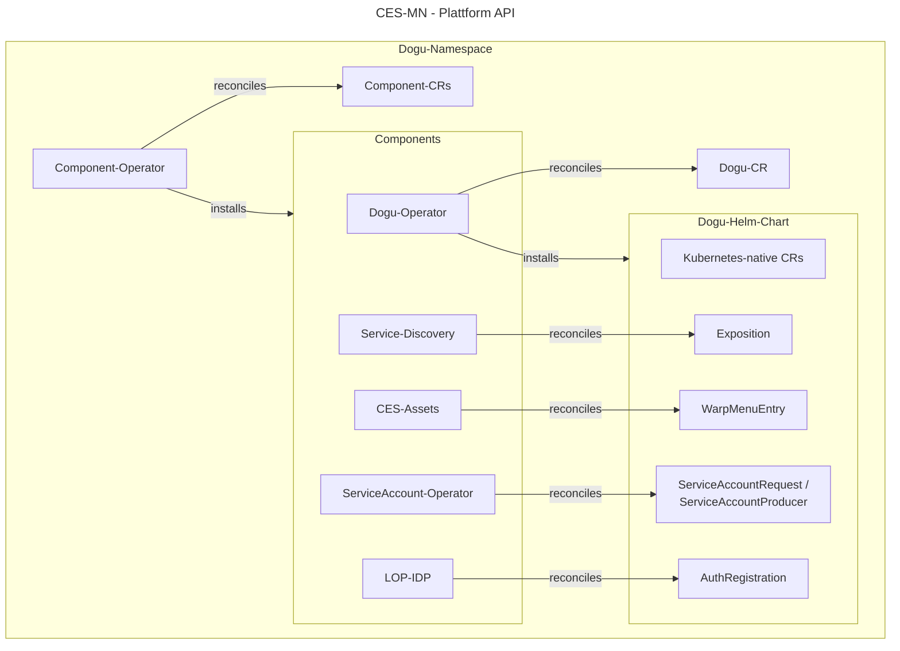

# Understanding the Multinode Runtime Environment

This document explains how the runtime environment of the Multinode variant of the Cloudogu EcoSystem (CES-MN) is structured and walks through its core concepts – from architecture and lifecycle to configuration, storage, networking, and the integration of Dogus into the platform.

For the MultiNode variant of the Cloudogu EcoSystem (CES-MN), Kubernetes serves as a distributed, highly available runtime
environment that ensures dynamic scaling and fault tolerance across multiple cluster nodes. The platform uses
Custom Resource Definitions (CRDs) to create Kubernetes-native abstractions for managing the entire platform.
They extend the Kubernetes API and allow Cloudogu's own operators to declaratively establish the desired target state of the platform.

## Key components

CES-MN primarily uses three key top-tier CRDs, which form the core of the architecture.

### Dogu CRD

The Dogu CRD describes a single application within the CES (such as SCM-Manager, Jenkins, Redmine, or SonarQube).

- **Purpose**: It serves as the declaration for the installation, configuration, and lifecycle of a single Dogu in the Kubernetes cluster.
- **Managed by**: The [Dogu Operator](https://github.com/cloudogu/k8s-dogu-operator/blob/main/docs/operations/overview_en.md).
- **How it works**: When a Dogu object is created or modified in the cluster, the operator takes care of deploying the Helm chart associated with the Dogu into the cluster.
The chart provides the workloads and can be integrated to the platform via CRDs, e.g. connection to SSO or integration into the central Warp menu.

### Component CRD

While a Dogu represents a user application, a Component represents a system and infrastructure building block that is required to operate the platform itself.

- **Purpose**: Management of core services such as the Identity Provider, monitoring, or Cloudogu-internal operators for platform integration.
- **Managed by**: The [Component Operator](https://github.com/cloudogu/k8s-component-operator/blob/develop/docs/operations/managing_components_en.md).
- **Difference from a Dogu**: Components are integrated more deeply into the cluster and form the foundation on which the Dogus can run in the first place.
They encapsulate Helm charts in order to provide base functionality consistently.

Component CRs are usually not installed by the end user, but are managed via the [Ecosystem Core](https://github.com/cloudogu/ecosystem-core/blob/main/docs/operations/configuration_en.md).
Ecosystem Core is a Helm chart that installs the core components required to run the CES-MN.

### Blueprint CRD

The Blueprint CRD sits hierarchically above the individual Dogus and represents the complete Dogu landscape of a tenant.

- **Purpose**: It defines the desired overall system (a "blueprint"), i.e. which combinations of Dogus should be installed in which versions and configurations.
- **Managed by**: The [Blueprint Operator](https://github.com/cloudogu/k8s-blueprint-operator/blob/main/docs/operations/explanation/introduction_en.md).
- **How it works**: A blueprint enables the automated, reproducible provisioning of complete environments.

When the Blueprint CR is processed, the operator creates the Dogu resources in the cluster and ensures that the entire platform is built up to the desired target state.
The use of blueprints in the CES is optional.

## Namespace and Tenant Separation

In the current architecture of CES-MN, all Dogus and system components are deployed together in a single
namespace. Since a cluster currently serves exactly one tenant, true multi-tenancy on the same cluster instance is currently not supported.
Each tenant environment therefore requires a dedicated Kubernetes cluster, which ensures strict and secure tenant separation at the infrastructure level.

Although the separation of namespaces may, at first glance, appear to promise efficient use of resources, this approach fails due to the lack of a genuine infrastructure boundary. Because resources are shared, risks such as container escapes or resource bottlenecks caused by other tenants continue to exist. For architectures such as CES-MN, the decision to use dedicated clusters per tenant therefore entails higher operational costs, but ensures uncompromising infrastructure-level isolation that both meets strict compliance requirements and minimises the risk of cross-tenant security incidents. 

## Lifecycle

Both the Dogu CR and the Component CR mentioned above describe the desired state from the platform's perspective. The lifecycle
of the associated Helm chart is bound to the respective CR. If the CR is deleted, the corresponding Dogu or
Component is deleted.

## Configuration

The `values.yaml` of the respective Helm charts is used as the public interface for configuring Components and Dogus.
Suitable default values should be provided for this, so that only instance-specific values need to be overridden in the values.
Instance-specific overrides are supplied via the Component, Dogu, or Blueprint CR and merged by the platform.

Configurations should always be made on the CR and not on the resources deployed via Helm. The platform monitors
the desired state based on the provided CR and overwrites any changes to the resources again via the operators' reconciliation loop.

## Storage and PVCs

Operating CES-MN requires a CSI-compatible storage driver and support for PVC expansion in the cluster.
In addition, a default storage class is already defined in the cluster, so it does not have to be defined in the PVC.

A Dogu chart defines the required PVCs and volume mounts itself. Unlike Dogu API V2, a Dogu can now use multiple volumes,
for example separated for application and database.

## Networking

For networking in CES-MN, a [CNI](https://github.com/containernetworking/cni)-compatible network driver (Container Network Interface) is used.
The platform has been successfully tested with [Calico](https://github.com/projectcalico/calico) and [Cilium](https://github.com/cilium/cilium). NetworkPolicies are used to secure the traffic between pods and namespaces.
To ensure the portability of the platform and to avoid vendor lock-in regarding the CNI driver, only Kubernetes-native NetworkPolicies (`apiVersion: networking.k8s.io/v1`) may be used.
The use of driver-specific CRDs for network rules should be avoided.

## Platform Integration via Cloudogu CRDs

To connect a Dogu or its application to the CES-MN, several CRDs are provided that serve as an API for the platform.
The CRDs represent an abstraction of the underlying technology and ensure a stable interface.
They encapsulate the complexity of the infrastructure, so that adjustments to the technology used or changes in the Kubernetes API
can be made without impairing the overall system. The following CRDs are available for connecting to the platform:

- **AuthRegistration**: Registers a Dogu with the IdentityProvider for the use of Single Sign-On
- **WarpMenuEntry**: Creates an entry in the Warp menu, the central navigation bar of the platform
- **Exposition**: Exposes the service of a Dogu so that routes or ports are reachable from the outside
- **ServiceAccountRequest**: Requests technical credentials of another Dogu or a Component
- **ServiceAccountProducer**: Defines how a ServiceAccount can be requested from your own Dogu

## Sources for Helm Charts and Dogu Container Images

The Helm charts for CES-MN as well as the required Dogu container images are currently available exclusively via
a [private OCI Registry](https://registry.cloudogu.com/). The retrieval and deployment of these artifacts
takes place directly via the Dogu Operator and the Component Operator, which are initially configured to access the
registry when the platform is set up.

For environments without direct internet access (air gap), both the required Helm charts and container images
can be mirrored into an internal OCI registry within the isolated environment.

## System Diagram

The following system diagrams illustrate the interplay between CRs in the cluster: The admin installs `ecosystem-core`, which deploys the Component Operator that installs the platform-side operators (including the Dogu Operator) via Component CRs. In parallel, the admin creates a Dogu CR that is reconciled by the Dogu Operator. The latter retrieves the associated Helm chart from the OCI registry. In addition to the workloads, the chart also contains the platform integration CRs, which are each reconciled by the responsible operator.

---

